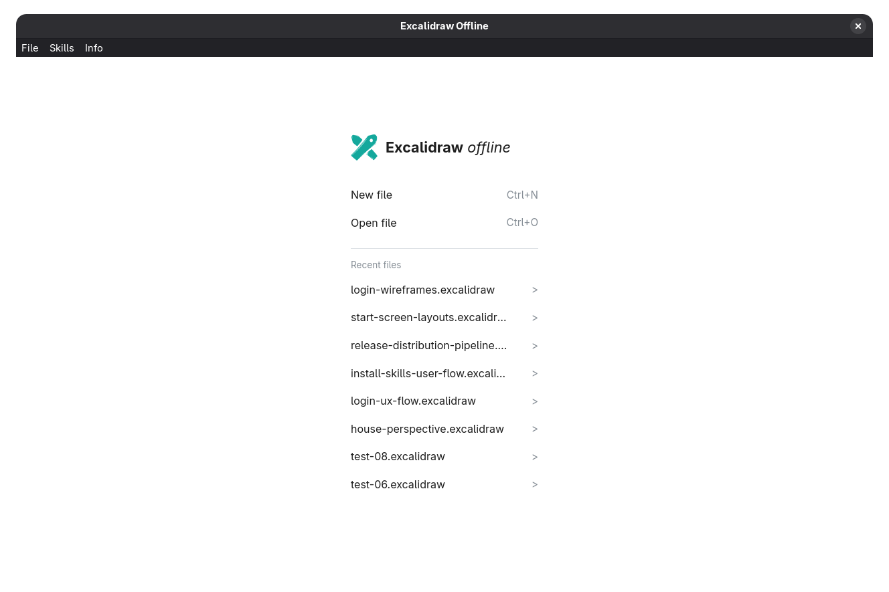
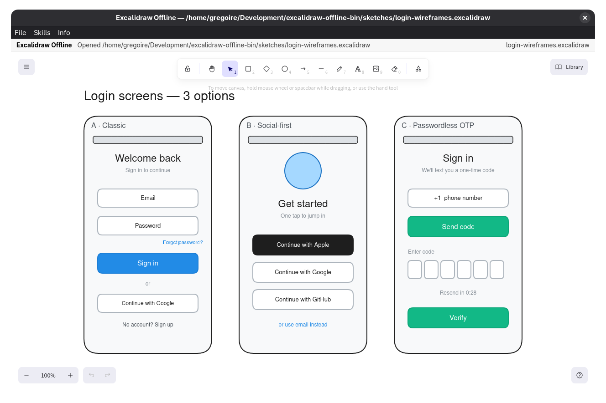

# Excalidraw Offline

Thin Deno Desktop wrapper around [@excalidraw/excalidraw](https://www.npmjs.com/package/@excalidraw/excalidraw) for offline desktop use on Linux and Windows 11, for you and your AI agent 🤖. It does **not** rebuild Excalidraw — it packages the upstream React component and adds local file open/save/autosave plus durable `assets/` attachments.

---

[Get started with Install](){: .btn .btn-primary .fs-5 .mb-4 .mb-md-0 .mr-2 }