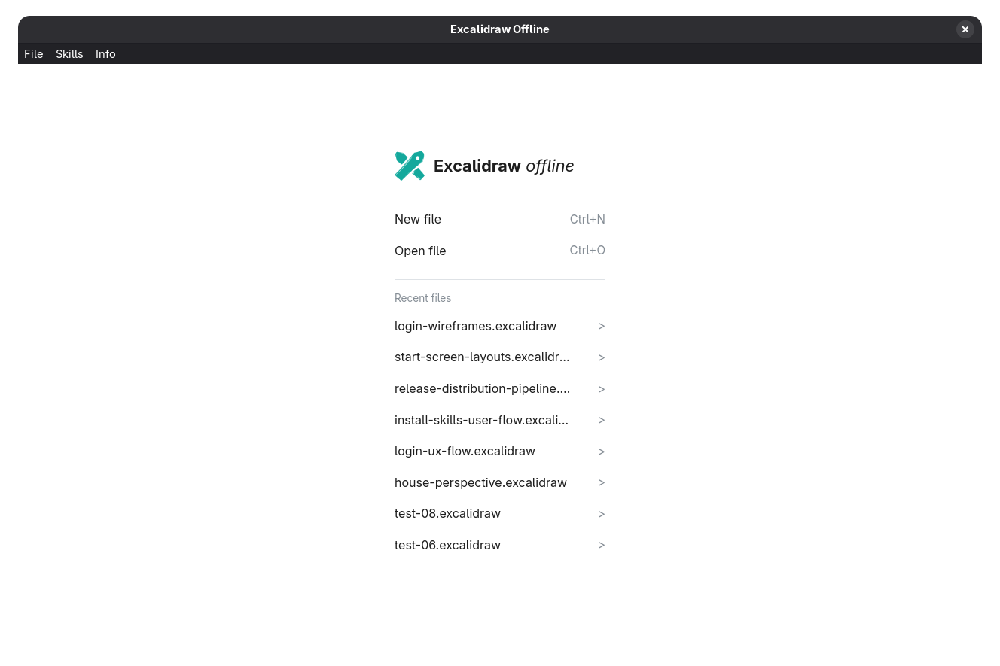
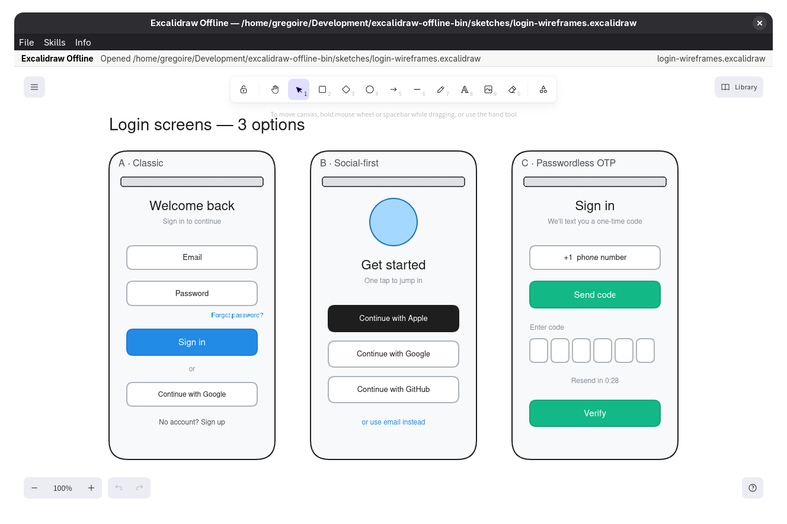

# Excalidraw Offline

Thin Deno Desktop wrapper around [@excalidraw/excalidraw](https://www.npmjs.com/package/@excalidraw/excalidraw) for offline desktop use on Linux, Windows 11, and Apple Silicon macOS, for you and your AI agent 🤖. It does **not** rebuild Excalidraw — it packages the upstream React component and adds local file open/save/autosave plus durable `assets/` attachments.

**Current version:** [v0.7.2](https://github.com/gfaurobert/excalidraw-offline-bin/releases/tag/v0.7.2) (Linux). **Install:** Linux → [latest release](https://github.com/gfaurobert/excalidraw-offline-bin/releases/latest); Windows and macOS → [v0.5.0](https://github.com/gfaurobert/excalidraw-offline-bin/releases/tag/v0.5.0) until newer Win/mac builds ship. See [Install]({{ '/install.html' | relative_url }}) and [What's new]({{ '/whats-new.html' | relative_url }}).

**File menu:** New, Open, Open Recent, Close, **Reload** (Ctrl+R / ⌘R — all platforms on v0.5.0+), Save, Save As. **Export image…** (Ctrl+Shift+E) and the headless **export** CLI are in **v0.6.0+** (Linux releases today). See [Usage]({{ '/usage.html' | relative_url }}).

---

[Get started with Install]({{ '/install.html' | relative_url }}){: .btn .btn-primary .fs-5 .mb-4 .mb-md-0 .mr-2 }
[What's new in v0.7.2]({{ '/whats-new.html' | relative_url }}){: .btn .fs-5 .mb-4 .mb-md-0 }
