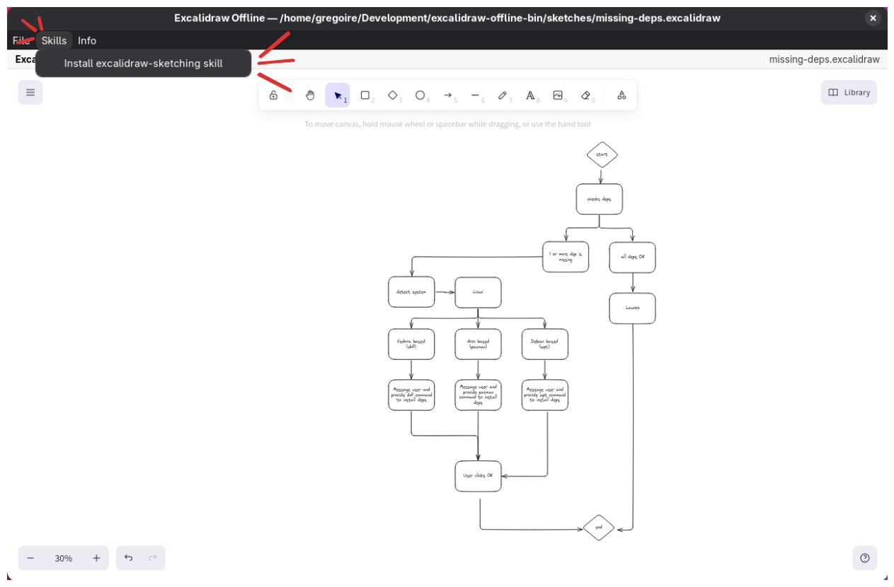
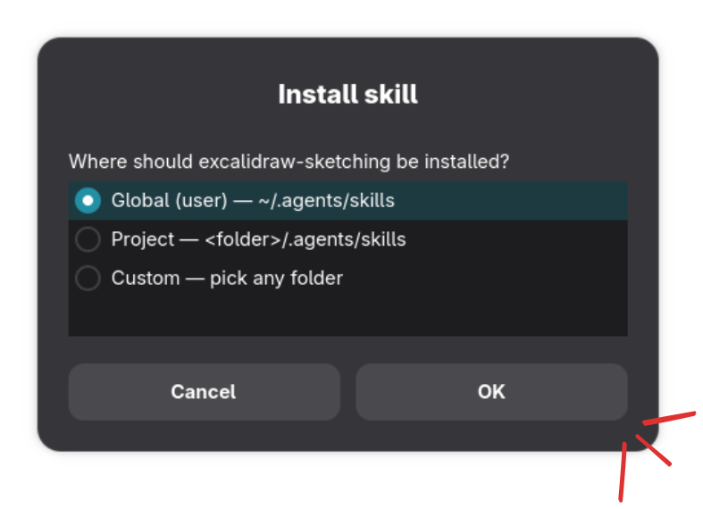

# Usage

## Start screen

On cold start the app shows a start screen (New / Open / Recent). The Excalidraw canvas mounts only after you choose an action. The app does not auto-open the last file.

## Files

- **New** (File → New / Ctrl+N)— blank Untitled drawing on the canvas
- **Open** (File → Open / Ctrl+O) — native zenity or kdialog file pickers for `.excalidraw` files anywhere on disk
- **Save** (File → Save / Ctrl+S) / **Save As**  (File → Save As / Ctrl+Shift+S) — native zenity or kdialog file pickers for `.excalidraw` files anywhere on disk
- **Open Recent** (File → Open recent) — up to 10 recently opened or saved paths (persisted under XDG config). Missing or unreadable paths are removed when selected
- **Close** (File → Close / Ctrl+W) — returns to the start screen (after unsaved prompts if needed)
- **Quit** (File → Quit) — exits the app

### Unsaved changes

- Dirty drawing with a path: flush/autosave write, then continue
- Dirty Untitled: native **Cancel / Save / Discard** dialog
- If zenity/kdialog is unavailable: status error; there is no typed-path fallback

## Autosave

Once a drawing has a file path, autosave writes back to that `.excalidraw` file. Brand-new Untitled drawings need Save / Save As before autosave can write. Crash recovery from a separate temp location is not part of the first version.

## Skills

Use **Skills → Install excalidraw-sketching skill** to copy the bundled [Agent Skill](https://agentskills.io) into a destination your coding agents can read.

Choose where to install:

- **Global (user)** — `~/.agents/skills/excalidraw-sketching/`
- **Project** — pick a project root, then `<root>/.agents/skills/excalidraw-sketching/`
- **Custom** — pick any folder; the skill is copied there as-is (no `.agents/skills` appended)

If the destination already exists, the app asks before overwriting. Decline aborts the install.

## Menus

- **Info** (native dialogs): Runtime backend, Assets tip, About Excalidraw Offline (wrapper version), About Excalidraw (upstream package version)

Transient open/save status appears in the app header (not a footer).
