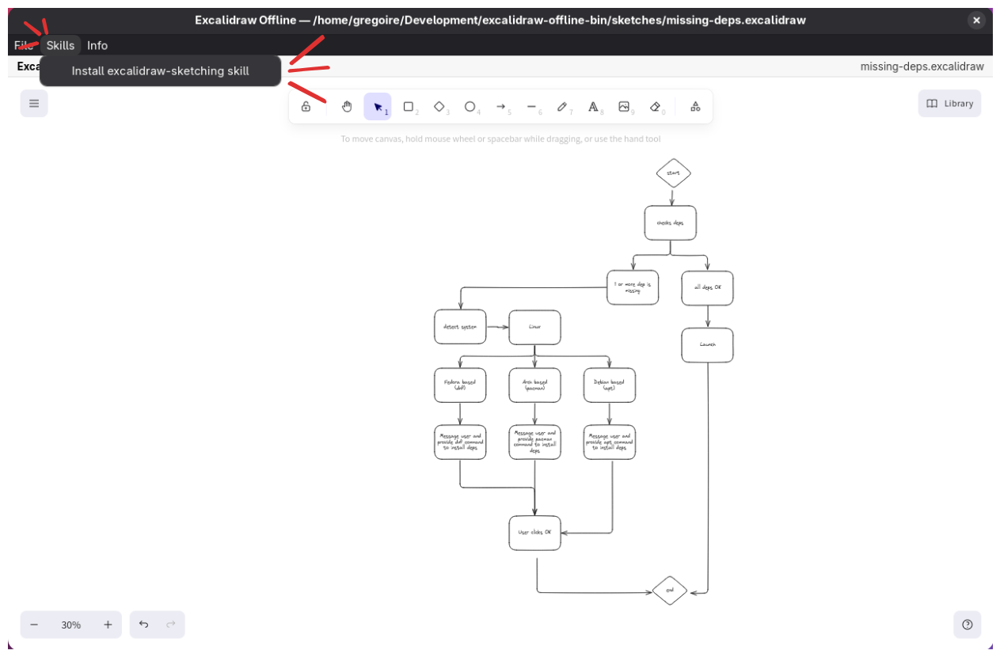
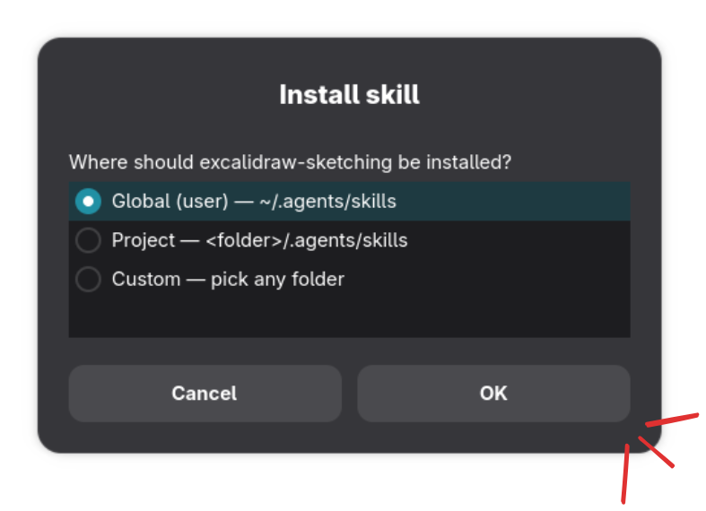

# Usage

## Start screen

On cold start the app shows a start screen (New / Open / Recent). The Excalidraw canvas mounts only after you choose an action. The app does not auto-open the last file.


## Files

- **New** (File → New / Ctrl+N)— blank Untitled drawing on the canvas
- **Open** (File → Open / Ctrl+O or ⌘O) — native file picker (zenity/kdialog on Linux, WinForms on Windows, osascript on macOS) for `.excalidraw` files anywhere on disk
- **Save** (File → Save / Ctrl+S or ⌘S) / **Save As**  (File → Save As / Ctrl+Shift+S or ⌘⇧S) — native file picker for `.excalidraw` files anywhere on disk
- **Open Recent** (File → Open recent) — up to 10 recently opened or saved paths (Linux: XDG config; Windows: `%APPDATA%\excalidraw-offline\recent.json`; macOS: `~/Library/Application Support/excalidraw-offline/recent.json`). Missing or unreadable paths are removed when selected
- **Close** (File → Close / Ctrl+W) — returns to the start screen (after unsaved prompts if needed)
- **Reload** (File → Reload / Ctrl+R or ⌘R) — re-reads the current file from disk and refreshes the canvas (disabled on the start screen and for Untitled drawings). Use this when something else changed the file on disk (e.g. a coding agent). Unsaved local edits trigger **Cancel / Save / Discard** (not a silent autosave) so reload does not overwrite external changes by accident
- **Export image…** (Excalidraw main menu → Export image, or **Ctrl+Shift+E** / ⌘⇧E) — upstream Excalidraw export dialog (preview, Only selected / Background / Dark mode / Embed scene, scale 1×–3×, filename, PNG / SVG / Copy to clipboard). PNG and SVG use the **native save dialog** (default folder: same directory as the saved `.excalidraw` file, or home when Untitled); the header shows the saved path. Copy to clipboard uses the webview when supported; otherwise a clear header error. Embed scene and other toggles match upstream behavior

### CLI export (agents)

Run PNG export without opening the interactive window (uses a short-lived hidden webview with the same `exportToBlob` path as the GUI). This command **does not** hand off to an already-running instance.

**Help** (stdout, exit 0, no GUI window):

```bash
excalidraw-offline --help
excalidraw-offline -h
excalidraw-offline export --help
excalidraw-offline export -h
deno task export -- --help
```

**Packaged app:**

```bash
excalidraw-offline export sketches/demo.excalidraw
excalidraw-offline export sketches/demo.excalidraw --frame "Login screen"
excalidraw-offline export sketches/demo.excalidraw --all-frames
excalidraw-offline export sketches/demo.excalidraw --element abc123 --element def456
excalidraw-offline export sketches/demo.excalidraw --bbox 0,0,800,600 --scale 2
excalidraw-offline export sketches/demo.excalidraw --out /tmp/custom --json
excalidraw-offline export sketches/demo.excalidraw --all-frames -d ~/sketches/export
```

**From a repo checkout** (builds frontend, compiles the local `dist/linux/excalidraw-offline` bundle if needed, then execs it — same argv as the packaged app):

```bash
deno task export -- sketches/demo.excalidraw
deno task export -- sketches/demo.excalidraw --frame "Login screen" --json
deno task export -- sketches/demo.excalidraw --all-frames -d ./exports
```

Set `EXCALIDRAW_DEBUG_ARGV=1` to print `Deno.args` on stderr when debugging launcher argv.

| Flag | Meaning |
|------|---------|
| *(none)* | Whole scene (default) |
| `--frame "Name"` | Repeatable; exact frame name match; one PNG per match |
| `--all-frames` | One PNG per **named** frame |
| `--element <id>` | Repeatable; one PNG with all listed elements selected |
| `--bbox x,y,w,h` | Scene coordinates; exports elements intersecting the box |
| `--out <path>`, `-d <dir>` | Destination directory (created if missing) or a single `.png` when there is exactly one job (default: folder containing the `.excalidraw` file) |
| `--scale N` | Export scale (default `2`) |
| `--json` | Print `{"paths":["…"]}` instead of one path per line |

Default output filenames: `{drawingBase}_{YYYYMMDD-HHMMSS}.png`, or `{drawingBase}_{frame}_{YYYYMMDD-HHMMSS}.png` when exporting a named frame. Collision suffixes (`-2`, `-3`, …) are added if the name already exists.

Stdout lists written file paths; stderr has diagnostics. Exit code `1` with a clear message if the file, frame, or element is missing. **Headless export requires `deno desktop` / the packaged app webview** (same as the GUI). Pure WSL without a Windows/macOS/Linux GUI webview may fail — run the command on the host OS or use File → Export in the GUI.
- **Quit** (File → Quit) — exits the app

### Open from CLI or file manager

```bash
excalidraw-offline /path/to/drawing.excalidraw
xdg-open /path/to/drawing.excalidraw   # Linux, after MIME install (package / AppImage integration)
```

```powershell
excalidraw-offline C:\path\to\drawing.excalidraw
```

```bash
open -a "Excalidraw Offline" --args /path/to/drawing.excalidraw   # macOS
"/Applications/Excalidraw Offline.app/Contents/MacOS/excalidraw-offline" /path/to/drawing.excalidraw
```

If the path does not exist yet, `excalidraw-offline` creates a blank `.excalidraw` there (parent directories included) and opens it. Existing files are opened as usual.

If another Excalidraw Offline window is already open on the **start screen** or a **saved** drawing, the file opens there (after a silent flush when the current drawing has a path). If the focused window is an **Untitled** sketch, a new window opens so you are not interrupted with Save/Discard.

### Cursor / agent note

Clicking a `.excalidraw` path in Cursor chat usually opens the file **inside the editor**, not in Excalidraw Offline. Agents should run `excalidraw-offline <path>` (or `xdg-open` on Linux, or `open -a "Excalidraw Offline" --args <path>` on macOS) instead of relying on chat links.

### Unsaved changes

- Dirty drawing with a path (Open, Close, New, Quit): flush/autosave write, then continue
- Dirty drawing with a path (**Reload**): native **Cancel / Save / Discard** — Discard drops local edits and loads disk; Save writes your version first, then reloads
- Dirty Untitled: native **Cancel / Save / Discard** dialog
- If zenity/kdialog (Linux), PowerShell WinForms (Windows), or osascript (macOS) is unavailable: status error; there is no typed-path fallback


## Autosave

Once a drawing has a file path, autosave writes back to that `.excalidraw` file. Brand-new Untitled drawings need Save / Save As before autosave can write. Crash recovery from a separate temp location is not part of the first version.

## Skills

Use **Skills → Install excalidraw-sketching skill** to copy the bundled [Agent Skill](https://agentskills.io) into a destination your coding agents can read.



Choose where to install:

- **Global (user)** — `~/.agents/skills/excalidraw-sketching/`
- **Project** — pick a project root, then `<root>/.agents/skills/excalidraw-sketching/`
- **Custom** — pick any folder; the skill is copied there as-is (no `.agents/skills` appended)



If the destination already exists, the app asks before overwriting. Decline aborts the install.

## Menus

- **Info** (native dialogs): Runtime backend, Assets tip, About Excalidraw Offline (wrapper version), About Excalidraw (upstream package version)

Transient open/save status appears in the app header (not a footer).
